# 基于springboot的学生宿舍信息的系统

---
### 👉作者QQ ：1556708905 微信：zheng0123Long (支持定制修改、部署调试、定制毕设)

### 👉接网站建设、小程序、H5、APP、各种系统等

---

#### 介绍

我开发了一个基于SpringBoot的学生宿舍信息管理系统，旨在提升宿舍管理的效率和学生的生活质量。该系统涵盖了管理员、维修人员、商家和学生四种角色，每个角色都有相应的功能模块，以满足不同用户的需求。通过该系统，管理人员可以高效地管理宿舍信息和学生信息，维修人员可以及时处理维修请求，商家可以管理桶装水的预订和配送，学生可以方便地获取宿舍公告、报修和预订服务等信息。系统提供了全面的功能和便捷的操作界面，促进了宿舍管理的数字化和智能化。

#### 技术栈

后端技术栈：Springboot+Mysql+Maven

前端技术栈：Vue+Html+Css+Javascript+ElementUI

开发工具：Idea+Vscode+Navicate

#### 系统功能介绍

管理员角色功能模块

个人中心：管理员可以管理个人信息，修改密码等。  
班级管理：录入和管理班级的基本信息，包括班级名称、人数等。  
学生管理：管理学生的基本信息，包括姓名、学号、联系方式等。  
维修人员管理：管理维修人员的信息和工作安排。  
商家管理：管理商家的基本信息和相关服务。  
宿舍信息管理：录入和管理宿舍的基本信息，包括宿舍楼、房间号、床位等。  
宿舍安排管理：管理学生的宿舍分配和调整。  
报修信息管理：记录和管理学生提交的报修信息。  
报修处理管理：安排维修人员处理报修请求，跟踪维修进度。  
假期留宿管理：管理学生在假期期间的留宿申请和安排。  
卫生检查管理：记录和管理宿舍的卫生检查结果。  
文明宿舍管理：评选和管理文明宿舍，激励学生保持宿舍卫生和秩序。  
缴费信息管理：记录和管理学生的住宿费用缴纳情况。  
桶装水品牌管理：管理宿舍使用的桶装水品牌信息。  
桶装水信息管理：录入和管理桶装水的供应和使用信息。  
桶装水预订管理：管理学生的桶装水预订信息。  
物品类别管理：管理失物招领中的物品类别信息。  
失物信息管理：记录和管理学生上报的失物信息。  
招领信息管理：记录和管理招领的物品信息。  
系统管理：系统的整体管理与维护，包括用户权限管理、系统日志查看、数据备份与恢复等。  

维修人员角色功能模块  

桶装水信息：查看和管理桶装水的供应和使用信息。  
失物信息：查看和管理失物的上报和招领情况。  
招领信息：查看和管理招领的物品信息。  
宿舍公告：查看宿舍的相关公告和通知。  
后台管理：  
报修信息管理：管理学生提交的报修信息。  
报修处理管理：处理报修请求，跟踪维修进度。  
个人中心：管理个人信息，修改密码等。  

商家角色功能模块

桶装水信息：查看和管理桶装水的供应和使用信息。  
失物信息：查看和管理失物的上报和招领情况。  
招领信息：查看和管理招领的物品信息。  
宿舍公告：查看宿舍的相关公告和通知。  
后台管理：  
桶装水信息管理：管理桶装水的品牌和供应信息。  
桶装水预订管理：管理学生的桶装水预订信息。  
个人中心：管理个人信息，修改密码等。  

学生角色功能模块

桶装水信息：查看宿舍供应的桶装水信息。  
失物信息：查看和管理失物的上报和招领情况。  
招领信息：查看和管理招领的物品信息。  
宿舍公告：查看宿舍的相关公告和通知。  
后台管理：  
宿舍安排管理：查看和管理自己的宿舍分配信息。  
报修信息管理：提交和管理报修信息，查看处理进度。  
报修处理管理：查看报修的处理情况和进度。  
假期留宿管理：提交和管理假期留宿申请。  
卫生检查管理：查看宿舍的卫生检查结果。  
文明宿舍管理：参与文明宿舍评选，查看评选结果。  
缴费信息管理：查看和管理自己的缴费信息。  
桶装水预订管理：提交和管理桶装水预订信息。  
失物信息管理：提交和管理失物信息。  
招领信息管理：查看和管理招领的物品信息。  
我的收藏管理：管理个人收藏的信息和资源。  
个人中心：管理个人信息，修改密码等。  

#### 系统作用

提升宿舍管理效率：管理员通过系统可以高效地管理学生信息、宿舍信息、维修请求等，减少手工操作，提高工作效率。  
便捷的维修处理：维修人员可以及时接收和处理报修信息，提高维修效率和质量，确保宿舍设备的正常运行。  
商家服务管理：商家可以通过系统管理桶装水的预订和供应，确保学生的生活需求得到及时满足。    
学生自助服务：学生可以通过系统方便地查看宿舍公告、提交报修、预订桶装水等，提高生活便利性和满意度。  
全面的信息管理：系统提供了丰富的信息管理功能，包括失物招领、卫生检查、文明宿舍评选等，保障宿舍的秩序和安全。  
数据统计与分析：系统可以对各种数据进行统计和分析，帮助管理人员做出科学决策，提高管理水平。  

#### 系统功能截图

代码结构

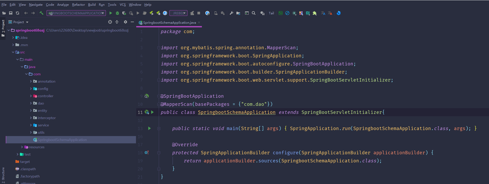

数据库表

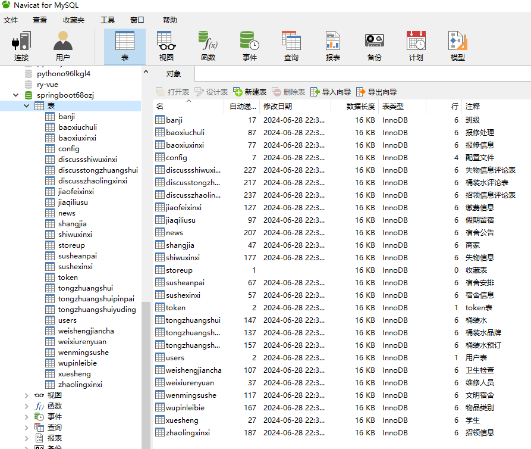

登录

班级管理

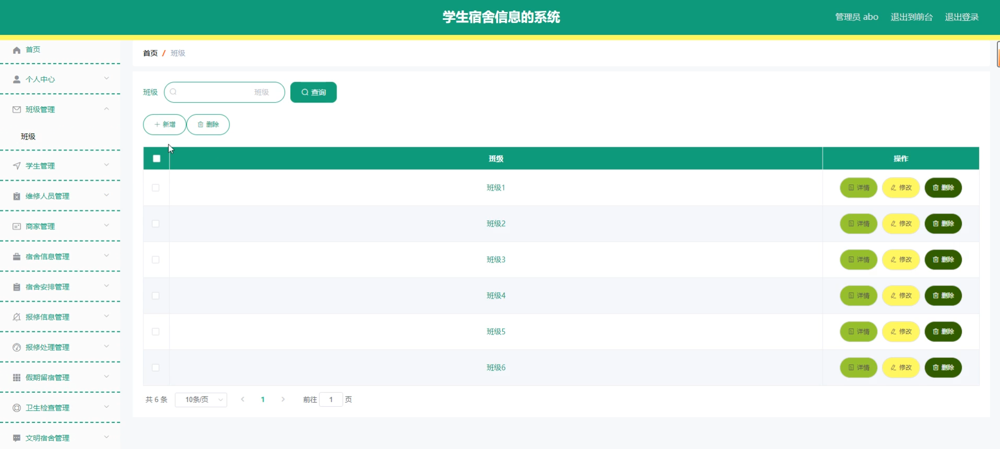

学生管理

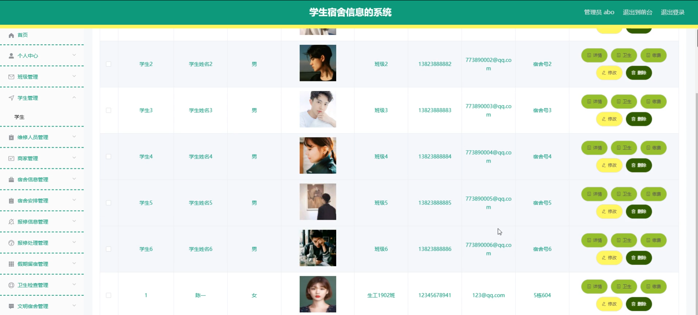

卫生检查管理

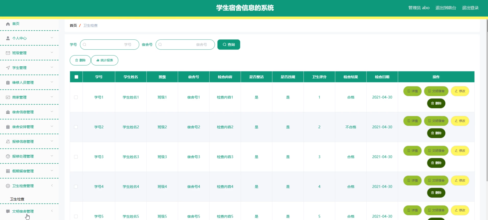

系统管理

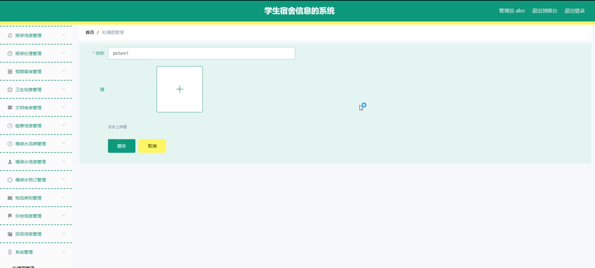

学生端报修信息管理

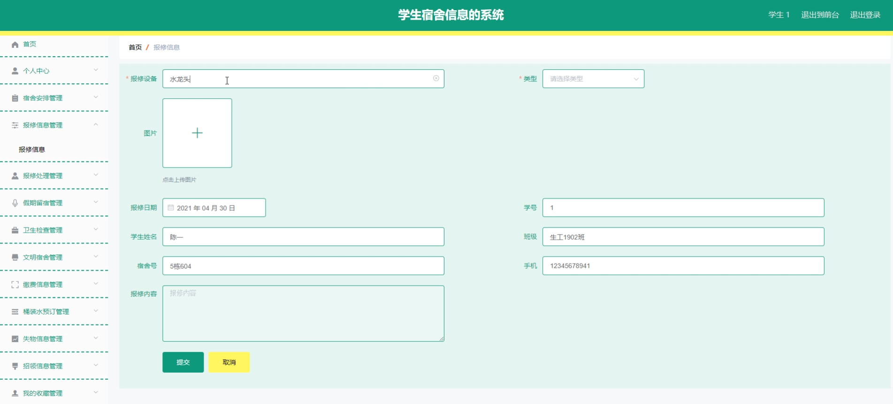

文明宿舍管理

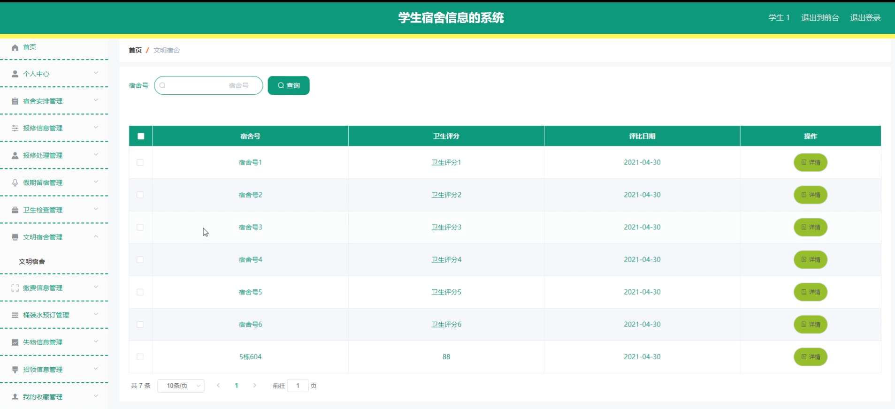

缴费信息管理

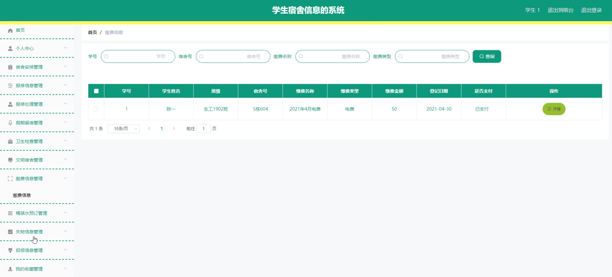

维修人员端报修信息

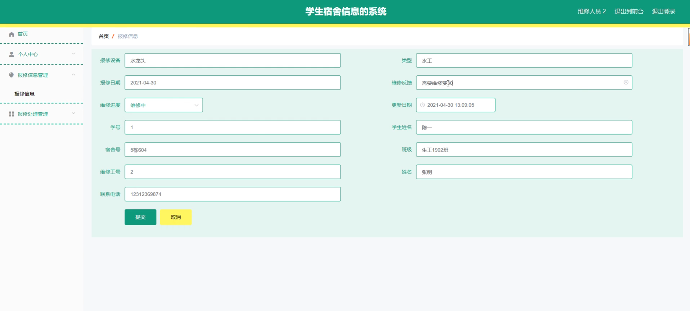

商家端后台管理页面

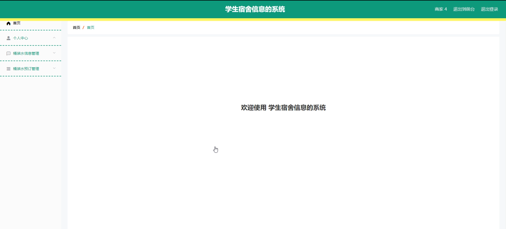

前台页面桶装水信息

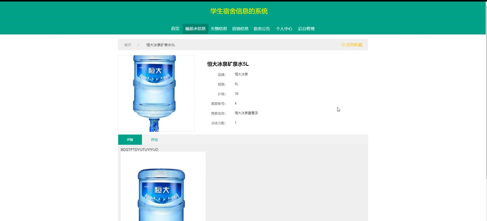

失物信息

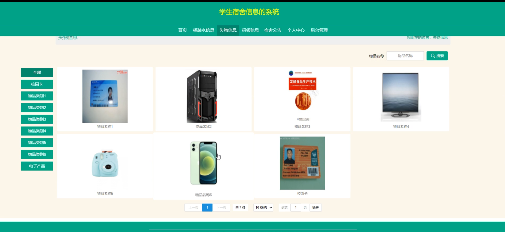

学生端招领信息管理

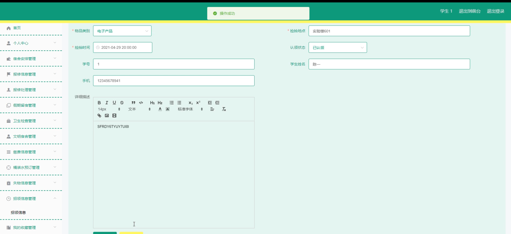

#### 总结

基于SpringBoot的学生宿舍信息管理系统通过集成多角色、多功能模块，实现了宿舍信息的高效管理和便捷查询。管理员、维修人员、商家和学生通过各自的角色和功能模块，提升了管理效率和用户体验。系统的全面性和互动性使其能够满足不同用户的需求，提升了宿舍管理和服务的整体水平。未来可以根据用户反馈和需求，继续优化和扩展系统功能，提供更完善的服务。

#### 使用说明

创建数据库，执行数据库脚本 修改jdbc数据库连接参数 下载安装maven依赖jar 启动idea中的springboot项目

后台地址:http://localhost:8080/springboot68ozj/admin/dist/index.html

管理员  abo 密码 abo

前台地址：http://localhost:8080/springboot68ozj/front/index.html

